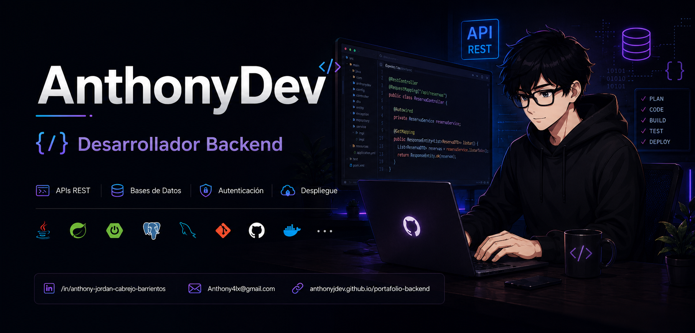

  

# 👩🏻‍💻 AnthonyDev

**`Desarrollador Backend`**

Mi nombre es Anthony  y soy estudiante de Ingenieria de Software, actualmente soy egresado tecnico de Desarrollo de Sistemas de Información. Tengo un gran interés por la tecnología, el desarrollo de software y la creación de soluciones web, escritorio y movil.

A lo largo de mi formación he desarrollado proyectos utilizando tecnologías como Java, Spring Boot, React, NestJs, Astro, MySQL, PostgreSQL, además de herramientas como Git, GitHub y Docker, etc. También he trabajado en la creación de APIs REST, autenticación con JWT, bases de datos relacionales y aplicaciones web completas.

Mi objetivo es seguir fortaleciendo mis habilidades, aprender nuevas tecnologías y adquirir experiencia profesional en el área de desarrollo de software, participando en proyectos que me permitan aplicar mis conocimientos y continuar creciendo como desarrollador.

    

---

### 🤖 Lenguajes y Tecnologias

 
 
